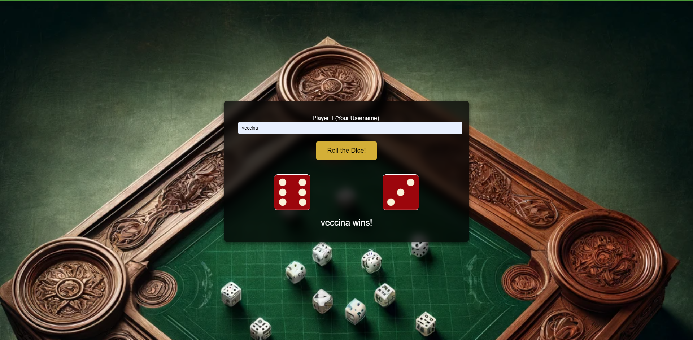

# Veccina Dice Game

## About The Project

Veccina Dice Game is a classic two-player dice game where the user (Player 1) competes against the computer (Player 2). The goal of the game is to roll higher than your opponent using random dice rolls.

## Game Rules

- Players roll their dice in turn.
- Each round, the results of both players are compared.
- The player with the higher dice roll wins the round.
- If both players roll the same number, the game is a draw.

## How to Play

1. Open the webpage.
2. Enter your username (optional).
3. Click the "Roll the Dice!" button to roll the dice.
4. See the results on the screen and roll again to start a new round.

## Screenshot

## Live Demo

Experience Veccina Dice Game live through the following link:
[Veccina Dice Game Live](https://veccina-dice-game.netlify.app)

## Development

This game was developed using modern web technologies, designed and coded with HTML, CSS, and JavaScript.

# Veccina Zar Oyunu

## Proje Hakkında

Veccina Zar Oyunu, kullanıcı (Oyuncu 1) ile bilgisayara (Oyuncu 2) karşı klasik bir iki oyunculu zar oyunudur. Oyunun amacı, rastgele zar atışlarıyla rakibinizden daha yüksek atmak.

## Oyun Kuralları

- Oyuncular sırayla zarlarını atar.
- Her turda, her iki oyuncunun da zar sonuçları karşılaştırılır.
- Daha yüksek zar atan oyuncu turu kazanır.
- Eğer her iki oyuncu da aynı sayıyı atarsa, oyun berabere sonuçlanır.

## Nasıl Oynanır

1. Web sayfasını açın.
2. Kullanıcı adınızı girin (isteğe bağlı).
3. "Zar At!" butonuna tıklayarak zarınızı atın.
4. Sonuçları ekranda görün ve yeni bir tur başlatmak için tekrar zar atın.

## Ekran Görüntüsü

## Canlı Demo

Veccina Zar Oyunu'nu aşağıdaki bağlantı üzerinden canlı olarak deneyimleyin:
[Veccina Zar Oyunu Canlı](https://veccina-dice-game.netlify.app)

## Geliştirme

Bu oyun, modern web teknolojileri kullanılarak geliştirilmiştir. HTML, CSS ve JavaScript ile tasarlanmış ve kodlanmıştır.

